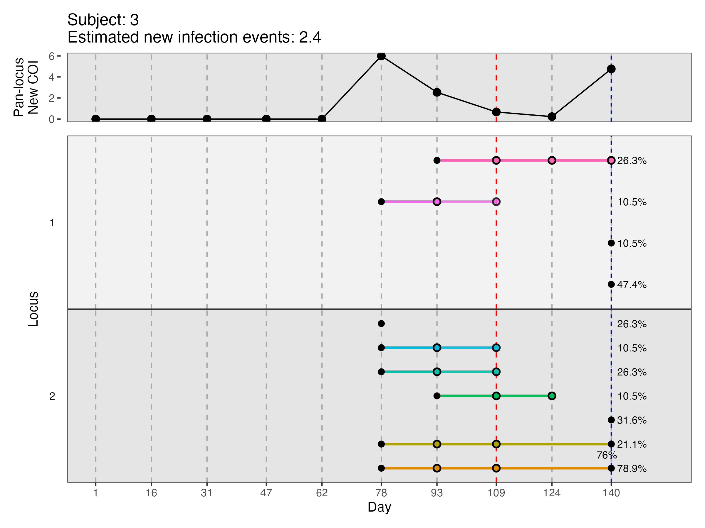

# DINEMITES

## Introduction ##

**DINEMITES** (**Di**stinguishing **Ne**w **M**alaria **I**nfections in 
**T**im**e** **S**eries) is a comprehensive R package for distinguishing
new from persistent infections in longitudinal sequencing data. It can 
determine probabilities individual alleles are new, estimate the new
molecular force of infection per person, and infer the
number of new infections over the observation period. It is intended
for use with longitudinal malaria studies, but it can be applied to any 
longitudinal data in which people can acquire a disease with multiple alleles
multiple times.

If you use the DINEMITES software, please cite our work:

> William A. Nickols, Philipp Schwabl, Daniel Neafsey. In progress:
Statistical models distinguish new malaria infections in time series sequencing
data.

### Support ###
For issues, bugs, or questions, please open an issue at 
https://github.com/WillNickols/dinemites/issues.

## Contents
* [1. Installing R](#installing-r)
* [2. Installing DINEMITES](#installing-dinemites)
* [3. Distinguishing new infections](#distinguishing-new-infections)
    * [3.1 DINEMITES input](#dinemites-input)
    * [3.2 Imputing qPCR only time points](#imputing-qpcr-only-time-points)
    * [3.3 Setting up covariates](#setting-up-covariates)
    * [3.4 Running models](#running-models)
* [4. Analyzing results](#analyzing-results)
    * [4.1 Merging probabilities](#merging-probabilities)
    * [4.2 Molecular force of infection](#molecular-force-of-infection)
    * [4.3 New infections](#new-infections)
    * [4.4 Data visualization](#data-visualization)

## Installing R

[R](https://www.r-project.org/) is a programming language specializing
in statistical computing and graphics. You can use R just the same as
any other programming languages, but it is most useful for statistical
analyses.

#### Installing R for the first time

You can download and install the free R software environment
[here](https://cloud.r-project.org/). Note that you should download the
latest release - this will ensure the R version you have is compatible
with DINEMITES.

#### The RStudio IDE

[RStudio](https://rstudio.com/products/rstudio/) is a freely available
IDE (integrated development environment) for R. It is a "wrapper" around
R with some additional functionalities that make programming in R a bit
easier.

#### Important: the correct R version

If you already have R installed, then it is possible that the R version
you have does not support DINEMITES The easiest way to check this is to
launch R/RStudio, and in the console ("Console" pane in RStudio), type
in the following command:

```
sessionInfo()
```

The first line of output message should indicate your current R version.
For example:

```
> sessionInfo()
R version 4.4.1 (2024-06-14)
```

For DINEMITES to install, you will need R >= 3.4. If your version is
older than that, please refer to section [Installing R for the first
time](#installing-r-for-the-first-time) to download the latest R. Note
that RStudio users will need to have RStudio "switch" to this later
version once it is installed. This should happen automatically for
Windows and Mac OS users when you relaunch RStudio. For Linux users you
might need to bind the correct R executable.
Either way, once you have the correct version installed, launch the
software and use `sessionInfo()` to make sure that you indeed have R >=
3.4.

## Installing DINEMITES

**Before installing DINEMITES**, `cmdstanr` must be installed. To do so, run 
the following commands:
```
install.packages("cmdstanr", 
                 repos = c('https://stan-dev.r-universe.dev', 
                           getOption("repos")))
cmdstanr::install_cmdstan()
```

Then, the latest version of DINEMITES can be installed from GitHub. To
install without vignettes, run the first chunk. To install with vignettes,
run the second:
```
if (!require("devtools", quietly = TRUE))
    install.packages("devtools")

devtools::install_github("WillNickols/dinemites", dependencies = TRUE)
```

```
if (!require("devtools", quietly = TRUE))
    install.packages("devtools")

devtools::install_github("WillNickols/dinemites", build_vignettes = TRUE,
    force = TRUE, dependencies = TRUE)
browseVignettes('dinemites')
```

On some computing spaces, security requirements might cause the installation
to fail with an error involving `-fPIE` or `-fPIC`. If this happens, rebuild
`cmdstan` with the necessary flags and then try installing again.
```
cmdstanr::cmdstan_make_local(cpp_options = list("CXXFLAGS+= -fPIE"))
cmdstanr::rebuild_cmdstan()
```

## Distinguishing new infections

### DINEMITES input

#### Sequencing input

At a minimum, DINEMITES requires a data frame of sequenced infections with the 
columns `allele`, `time`, and `subject`. The `allele` column should have the
name of the genetic variant sequenced in the sample (e.g., `A206G`, 
`pfama1.21`, `11`). The `time` column should be a numeric value denoting when
the sample was collected (typically the number of days since the start of
the study). The `subject` column should be a subject identifier for the
person who contributed the sample. If multiple alleles are detected at the
same time point for the same person, there should be multiple rows with the
same `subject` and `time` but different values in `allele`. If some samples
do not have any sequenced alleles (i.e., no infection), rows should be
included with the corresponding `time` and `subject` but `NA` in the `allele`
column. **If samples without infections are not included, the downstream
results could be very biased.** In general, the visits should be similarly
spaced for all subjects, but minor violations of this (e.g., unexpected visits) 
should not be too problematic. If multiple loci are sequenced, the locus
name of the allele should be included in the `locus` column. **Allele names 
should still be unique even across loci.** In this data 
frame, other sample-specific information can be included including covariates
that affect the rate at which a person becomes infected (`season`, LLIN
usage, etc.).

Here, we'll use a synthetic dataset of 5 subjects sequenced at 2 loci created
to compactly illustrate the features of DINEMITES.

```
suppressPackageStartupMessages(library(dinemites))
suppressPackageStartupMessages(library(dplyr))
dataset <- read.csv(system.file(package="dinemites","extdata","dataset.tsv"), 
                    header = TRUE, sep="\t")
```

The function `fill_in_dataset` then takes the dataset and turns it into
its complete format by creating a row for each allele for each subject 
and time and adding a `present` column that is 0 or 1 depending on whether
the allele was absent or present:

```
dataset_filled_in <- fill_in_dataset(dataset)
```

#### qPCR only input

If some time points are known to have infections but don't have sequencing
information (e.g., because ultrasensitive qPCR was used before sequencing),
these points can be included as a data frame with columns `subject` and `time`.
These points should also be included in the original data frame with `allele`
set to `NA`. If a time point is neither sequenced nor has detection information
from an alternative source (i.e., no qPCR), one of two strategies could
be employed. First, the time point could be excluded. Second, the time point 
could be marked as qPCR positive or negative
depending on whether the next closest time point involved an infection, and then
the imputation procedure could be run (see below). In general though,
these completely missing time points can be problematic because they either
increase the apparent time to last observation (first strategy) or require
guessing whether there was an infection (second strategy).

```
qPCR_only <- read.csv(system.file(package="dinemites","extdata","qPCR_only.tsv"), 
                      header = TRUE, sep="\t")
```

These qPCR-only time points are then added to the dataset, where
they replace the `present` values for all alleles at the corresponding
subject time with the value `2`.
```
dataset_with_qPCR <- add_qpcr_times(dataset_filled_in, qpcr_times = qPCR_only)
```

#### Treatments

Additionally, a data frame of treatments can be provided with a `subject`
and `time` column indicating when individuals were treated for infections. 
The treatments included in this data frame should only be those expected
to clear malaria infections (not simply treating fever etc.).

```
treatments <- read.csv(system.file(package="dinemites","extdata","treatments.tsv"), 
                       header = TRUE, sep="\t")
```

#### Time series visualization

We can visualize the infection time series for one of the subjects using
the `plot_single_subject` function. In the plot below, each X indicates
the presence of a sequenced parasite allele, and they are connected by
colored lines if the same allele is observed multiple times. The red line
indicates that a qPCR-only infection occurred on day 109, and the blue line
indicates that the person received treatment on day 140.

```
plot_single_subject(3, dataset_with_qPCR, treatments)
```


### Imputing qPCR only time points

When some time points are only known to be qPCR positive, multiple
imputation is used to create multiple datasets with the
qPCR positive time points replaced probabilistically by specific alleles. 
Multiple imputation is a widely used statistical technique to handle missing
data by generating multiple copies of the dataset with the missing values
replaced by values imputed from the rest of the data.
In this multiple imputation, alleles are inferred based on which alleles 
were present at the other, sequenced time points for the subject, using 
patterns learned from parts of the dataset with complete sequencing data.
The function `add_probability_present` then adds a column to `dataset` with
the probability each allele was present based on the imputations.

```
set.seed(1)
n_imputations <- 10

imputed_datasets <- impute_dataset(dataset_with_qPCR, 
                                   n_imputations = n_imputations, 
                                   verbose = FALSE)

dataset_after_imputation <- add_probability_present(dataset_with_qPCR, imputed_datasets)
plot_single_subject(3, dataset_after_imputation, treatments)
```


In the plot, we see that the ambiguous infection on day 109 has been imputed
to consist of specific alleles (the opacity `alpha` is equal to the
proportion of times the allele is imputed to be present). By default, 10
imputed datasets are created, but this can be increased up to 50 for better
precision. Imputing more than 50 datasets is typically unnecessary.

### Setting up covariates

DINEMITES includes three models for distinguishing old from persistent
infections: a Bayesian model, a clustering model, and a simple model. The simple
model and clustering model do not use information beyond allele presence
and absence patterns, but the
Bayesian model relies on modeling the rate at which infections occur newly
and after previous infections. To this end, we can include a variety of 
covariates that affect the probability an infection will be observed at a
given time for a given subject. The following functions add columns of
covariates for each imputed dataset:

1. `add_time_gap`: Adds the time since the last appointment with the `default`
changed to `-14` (i.e., infections at the first the time point are counted from 
day `-14` until day `1`).
1. `add_present_infection`: Adds an indicator of whether there is an infection
from any allele.
2. `add_persistent_column`: Adds an indicator of whether there has been an
infection with each row's allele before that row's time. This corresponds to the
intuition that the probability of observing an allele at any point in the
future might be higher than at baseline because the parasite might still be
present, even after a long gap.
3. `add_persistent_infection`: Adds an indicator of whether there has been an
infection from any allele before that row's time.
4. `add_lag_column`: Adds an indicator of whether there has been an infection
with each row's allele in the last `30` (default) days. This corresponds to the
intuition that the probability of observing an allele shortly after previously
observing the allele is higher than the probability of observing it at baseline 
because the parasite is likely still present. 
5. `add_lag_infection`: Adds an indicator of whether there has been an infection
with any allele in the last `30` (default) days.
6. `add_treatment_column`: Adds indicators of whether there was treatment
for the row's allele between 1 and 10 days ago (default) for the 
`treatment_acute` column and 10 or more days ago (default) for the
`treatment_longitudinal` column. This also sets the `persistent` and `lag_30`
columns generated in (2) and (4) to 0 after treatment. This corresponds
to the intuition that being treated should clear out parasites and therefore
return the person to having no infections. However, the new columns allow
the Bayesian model to account for incomplete clearance either shortly after
or substantially after treatment.
8. `add_treatment_infection`: Adds indicators of whether there was treatment
for any allele between 1 and 10 days ago (default) for the 
`treatment_acute_infection` column and 10 or more days ago (default) for the
`treatment_longitudinal_infection` column. This also sets the 
`persistent_infection` and `lag_infection_30`
columns generated in (3) and (5) to 0 after treatment.

For each of these functions, the `column` version is specific to the allele 
(i.e., was this allele observed recently?) while the `infection` version
applies to an infection by any allele (i.e., was any infection observed
recently?). The functions `add_persistent_[column/infection]` should only be 
called once, but `add_lag_[column/infection]` can be called multiple times
with different `lag_time` parameters to specify different time intervals
over which there might be different probabilities of observing a persistent
allele (e.g., 30, 60, and 90 days).

```
suppressPackageStartupMessages(library(doParallel))
suppressPackageStartupMessages(library(foreach))
suppressPackageStartupMessages(library(doRNG))

# Can replace with more cores if available
n_cores <- ifelse(detectCores() > 1, 2, 1)
cl <- makeCluster(n_cores)
registerDoParallel(cl)

# Store imputed datasets with resulting covariates as a list
datasets <- foreach(i = 1:n_imputations, 
                    .packages = c('dinemites', 'dplyr')) %dopar% {
    # Copy original dataset and use the ith imputed vaules
    dataset_tmp <- dataset_after_imputation
    dataset_tmp$present <- imputed_datasets[,i]

    # Add all covariates for that imputed dataset
    dataset_tmp <- dataset_tmp %>%
        add_time_gap() %>%
        add_present_infection() %>%
        add_persistent_column() %>%
        add_persistent_infection() %>%
        add_lag_column() %>%
        add_lag_infection() %>%
        add_treatment_column(treatments = treatments, verbose = F) %>%
        add_treatment_infection(treatments = treatments, verbose = F)
    
    dataset_tmp
}

stopCluster(cl)
```

### Running models

New infections can be identified with three models that assign a
probability (including 0 or 1) to each observed allele of being from a new
infection. Except for the Bayesian model in the non-default drop-out mode
(explained later), these models give the probability each observed allele is 
from a new
infection relative to its last observation (if any). That is, if a single 
infection spans two visits but an allele is only observed on the second
visit, this allele will be classified as new rather than persistent (though
alleles that were sequenced on both days would likely be classified as
persistent).

#### Simple model

The first model for distinguishing new from persistent infections is a
simple rule that counts an allele as new if it has not been observed in
the `n_lags` most recent samples (e.g., visits) and the `t_lag` most recent
times (e.g., days). If the allele has been observed in both the last
`n_lags` samples and the last `t_lag` times, it is considered new.

```
n_cores <- ifelse(detectCores() > 1, 2, 1)
cl <- makeCluster(n_cores)
registerDoParallel(cl)

# Run the simple model for each dataset and store the probabilities
# in a matrix, one column for each imputation
probabilities_simple_mat <-
    foreach(i = 1:n_imputations, 
            .combine = cbind, 
            .packages = c('dinemites', 'dplyr')) %dopar% {
    probabilities_simple <- determine_probabilities_simple(datasets[[i]])
    probabilities_simple$probability_new
}

stopCluster(cl)
```

#### Bayesian model

The second model for distinguishing new from persistent infections is a
Bayesian model that models the rate at which new infections are acquired and
the rate at which any infections (both new and persistent) 
are acquired and uses laws
of conditional probability to find the probability each allele is new. The
model is parameterized with **general covariates** that affect the rate at which
new infections are acquired (the season, LLIN usage, etc.) and **persistence
covariates** that affect how likely a persistent infection is to be observed
again (whether the allele has ever been observed, has been observed in the
last 30 days, etc.). A model is fit in Stan, and the posterior coefficient
draws are used to estimate the probability each allele is new. **The model
will run with covariates taking on any values, but the model fits much faster
when the covariates take only one of a few values** (e.g., 0/1 indicators)
by collapsing redundant observations in the likelihood function.

This model uses the covariates created in [section 3.3](#setting-up-covariates)
and should take a few minutes to run. The fit probabilities can also be
read in from 
`system.file(package = "dinemites", "extdata", "probabilities_bayesian_mat.tsv")`.

*Note: The Bayesian model can be run with `drop_out = TRUE` to allow alleles
to be classified as persistent even if they have never been observed before
due to sequencing drop-out. This is primarily intended for cases in which the
estimated sequencing drop-out is above 50%, which can be estimated with
`estimate_drop_out`.*

```
estimate_drop_out(dataset_after_imputation)

n_cores <- ifelse(detectCores() > 1, 2, 1)
cl <- makeCluster(n_cores)
registerDoParallel(cl)

probabilities_bayesian_mat <-
    foreach(i = 1:n_imputations, 
            .combine = cbind, 
            .packages = c('dinemites', 'dplyr')) %dorng% {
    probabilities_bayesian <- determine_probabilities_bayesian(
        dataset = datasets[[i]],
        infection_persistence_covariates =
            c("persistent_infection",
              "lag_infection_30",
              "treatment_acute_infection",
              "treatment_longitudinal_infection"),
        infection_general_covariates =
            c("season"),
        alleles_persistence_covariates =
            c("persistent",
              "lag_30",
              "treatment_acute",
              "treatment_longitudinal"))
    
    probabilities_bayesian$probability_new
    }

stopCluster(cl)
```

#### Clustering model

The third model for distinguishing new from persistent infections is a 
clustering model that, for each subject, clusters alleles according to
co-occurrence, finds optimal probabilities each allele is present in each 
cluster and each cluster is present at each time point, and uses these to 
calculate the probability an allele is new.
```
n_cores <- ifelse(detectCores() > 1, 2, 1)
cl <- makeCluster(n_cores)
registerDoParallel(cl)

probabilities_clustering_mat <-
    foreach(i = 1:n_imputations, 
            .combine = cbind, 
            .packages = c('dinemites', 'dplyr')) %dorng% {
        probabilities_clustering <- 
            determine_probabilities_clustering(dataset = datasets[[i]])
        probabilities_clustering$probability_new
}

stopCluster(cl)
```

#### Runtime
The following guidelines can help with choosing models that run in reasonable
amounts of time:

* Imputation: The imputation procedure scales approximately linearly in
the number of subjects, the number of alleles, and the number of time points
per subject. It scales approximately exponentially in the parameter `k`, so 
changing `k` from its default is typically not recommended. Imputing 10 datasets
for 100 alleles, 200 subjects, and 20 time points per subject should take less
than 10 minutes, and it is unlikely to be the most computationally intensive
step.
* Simple model: The simple model scales linearly with the number of subjects,
the number of alleles, and the number of time points per subject. It should
take less than 1 minute (per imputed dataset) for 100 alleles, 200 subjects, 
and 20 time points per subject, and it is unlikely to be the most 
computationally intensive step.
* Bayesian model: The Bayesian model scales linearly with the number of alleles
and the number of formula variables and up to linearly with the number of
subjects and the number of time points per subject. It should
take about an hour (per imputed dataset) for 100 alleles, 200 subjects, 
20 time points per subject, and 4 formula variables, and it is likely to be the
most computationally intensive step. Running imputed datasets in parallel is 
strongly recommended, and filtering out rare alleles can help substantially.
* Clustering model: The clustering model scales linearly with the number of 
subjects, the number of alleles, and the number of time points per subject. It 
should take less than 5 minutes (per imputed dataset) for 100 alleles, 200 
subjects, and 20 time points per subject, and it is unlikely to be the most 
computationally intensive step.

## Analyzing results

### Merging probabilities

First, we will add the probabilities to the dataset with the function
`add_probability_new`, which checks that the matrices of probabilities
to add are valid and then adds on the (average) probability of the allele being
new (given that it is present, if using imputations):
```
dataset_with_clustering <- add_probability_new(dataset_after_imputation, 
                               probabilities_clustering_mat, 
                               'probability_clustering')

dataset_with_bayesian <- add_probability_new(dataset_with_clustering, 
                               probabilities_bayesian_mat, 
                               'probability_bayesian')
```

We want one consensus probability rather than two columns of probabilities,
so we will use `merge_probability_columns` to combine the results from
the Bayesian model and the clustering model. This function takes the average
of the probabilities within the threshold (`0.3` by default) and allows
us to select probabilities manually if they are sufficiently discordant.
To ensure this file knits, we will just set `probability_new` to the
Bayesian probabilities, but when run in an interactive session (e.g., Rstudio),
running `merge_probability_columns` will display each discordant row and a plot
highlighting the discordant value and ask the user to choose a probability. To
try this, copy the chunk with `merge_probability_columns` into the console
and run it.

```
dataset_with_probability_new <- merge_probability_columns(dataset_with_bayesian, 
    c('probability_clustering', 'probability_bayesian'), 
    threshold = 0.3)
```

### Molecular force of infection

The molecular force of infection (molFOI) is the number of genetically unique
parasite strains detected (counted multiple times if they are new multiple
times).
Typically, the estimated new infections and/or the molFOI are the
key outcomes of interest from a study using this type of data.

When only one locus is sequenced, the molecular force of infection is 
simply 
estimated by the sum of: for each allele, the probability the allele is new 
multiplied by the probability the allele is present (1 if sequenced and 
present, 0 if not present, between 0 and 1 if imputed).

When there are multiple loci, adding across the loci would
overcount because alleles at different loci might correspond to the same
parasite. Therefore, two counting procedures are implemented. Both start by, 
for each individual, for each locus at each time point, taking the sum across 
the alleles of the probability the allele is new multiplied by the probability 
the allele is present. Then, the two procedures do the following:

* `sum_then_max`: For each locus, sum these sums across all time points. 
Then, take the maximum of the per-locus sums.
* `max_then_sum`: For each time point, take the maximum of the sums. 
Then, sum the maxima over the time points.

The `sum_then_max` method ensures that drop-out in alleles at different loci at 
different times does not result in double counting. The `max_then_sum`
method ensures that 
if different infections have different diversities at the different loci, 
the different infections are all counted in full. Typically, `max_then_sum`
should only be used if the sequencing is very accurate (<20\% drop-out). 

These can be specified as `method` in `compute_molFOI`:

```
compute_molFOI(dataset_with_probability_new, method = 'sum_then_max') %>%
    knitr::kable() %>%
    kableExtra::scroll_box(height = "200px", extra_css = "border: none;") %>%
    kableExtra::kable_styling("striped", full_width = F, position = 'center')
```

*Note: The molFOI is computed from the probability each allele is
present and new, averaged over the imputed datasets if necessary. Therefore,
manually merging probabilities (e.g., [Merging probabilities](#merging-probabilities))
after running `add_probability_new` will affect the molFOI.*

### New infections

Additionally, the number of new infections can be estimated based on the
sequencing data. The number of new infections is estimated by counting
the number of peaks in the pan-locus new complexity
of infection and then accounting for the
maximum and minimum novelty throughout the peaks. Sometimes, the estimated
new infections might appear unexpectedly high, but this is typically because
there are many time points with moderate-low probabilities of new infections
that add up. We estimate the number of new infections with 
`estimate_new_infections`. When using imputations, this function requires
the matrix of imputed values and the matrix of determined probabilities since
it estimates the new infections from each imputed dataset.

```
estimated_new_infections <- estimate_new_infections(dataset_with_probability_new, 
                        imputation_mat = imputed_datasets, 
                        probability_mat = probabilities_bayesian_mat) 

data.frame(subject = rownames(estimated_new_infections),
           new_infections = rowMeans(estimated_new_infections)) %>%
    knitr::kable() %>%
    kableExtra::scroll_box(height = "200px", extra_css = "border: none;") %>%
    kableExtra::kable_styling("striped", full_width = F, position = 'center')
```

*Note: The total new infections are computed from each imputed dataset
separately. Therefore, if probabilities are to be merged manually
(e.g., [Merging probabilities](#merging-probabilities)), this must be
done for every imputed dataset separately, the results must be stored in one
matrix, and `estimated_new_infections` can then be run.*

### Data visualization

The results can be visualized for an individual subject with 
`plot_single_subject` or for all subjects with `plot_dataset`. Supplying the
`treatments` and `estimated_new_infections` data frames will display
these on the plots. The function
`plot_dataset` also shows the prevalence of each allele (proportion of 
sequencing-positive samples in which the allele was present) to the right. As
before, red lines indicate qPCR-only time points, and blue lines indicate 
treatment. Black dots indicate the allele was new with a probability >50\%.
Open dotes indicate the allele was new with a probability <50\%. If the dots 
are not annotated, the probabilities are >80\% or <20\% respectively, and all 
other dots are annotated with their probabilities of being new.

```
all_plots <- plot_dataset(dataset_with_probability_new, 
                            treatments, 
                            output = 'output')
print(all_plots[[3]])
```




